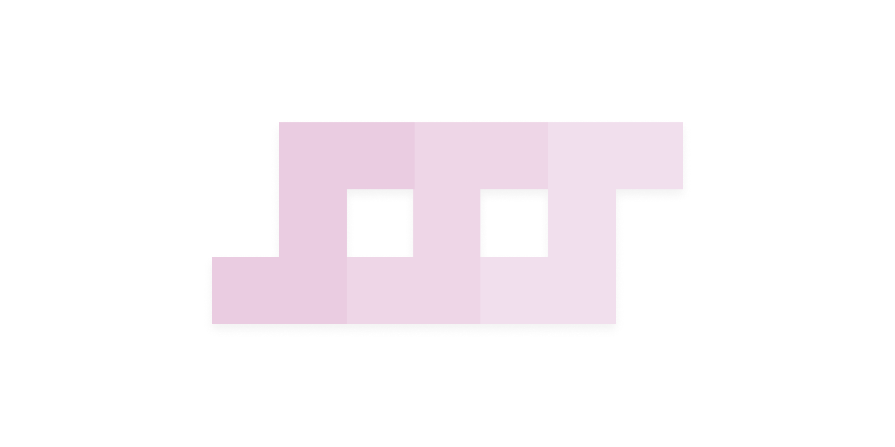

<p align="center">
	
</p>

### What is <kbd>sss</kbd>?

<kbd>sss</kbd> is a shortcut/hotkey software written with just POSIX
shell script, and very few other utilities, with a short dependency list
of things that you likely already have installed, its therefore quite
minimal.

### Why should you use it?

Who said you should? I sure didn't, because I'm not sure you should. I
mean, it's a hotkey daemon written in POSIX shell script.

### Dependencies

Coreutils (you have these, unless you're cynical):
 - `tr`
 - `rm`
 - `cat`
 - `sed`
 - `grep`
 - `pgrep`
 - `mkdir`
 - `touch`
 - `stdbuf`
 - `mkfifo`

Other dependencies (you may have these already):
 - `xinput`
 - `xmodmap`

### Installation

```sh
$ git clone https://github.com/KiruPoruno/sss; cd sss
$ install -m 755 -D sss /usr/bin/sss
```

### Configuring

Open the `rc.example` file, and read the top comment in there, it
explains how the config system works, on top having example binds.
